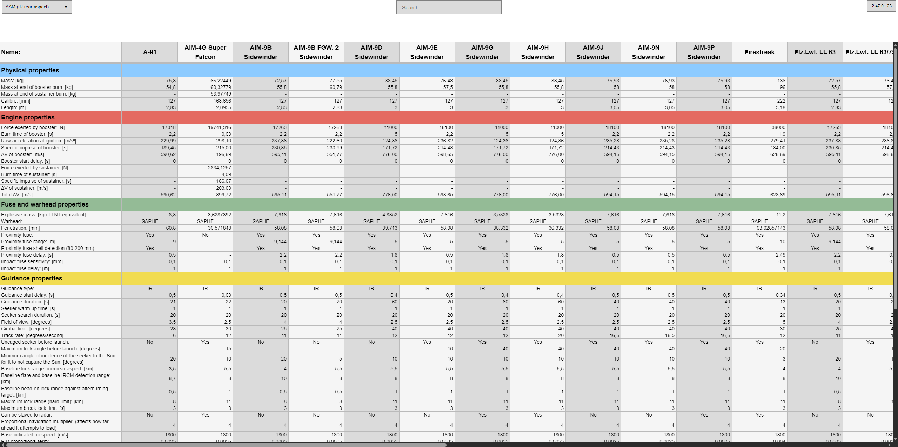
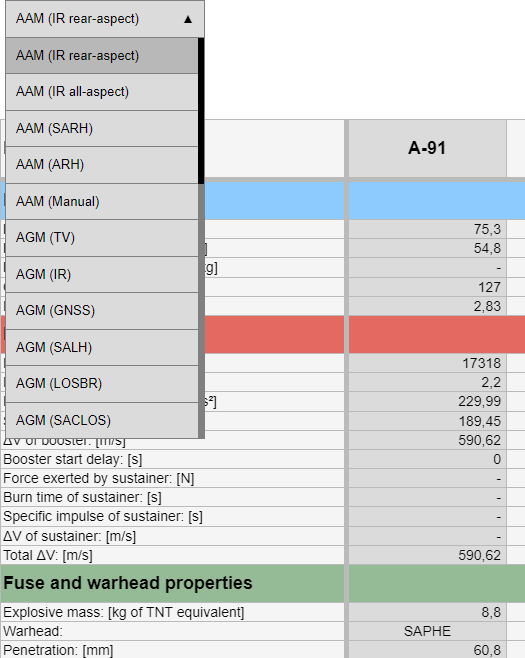
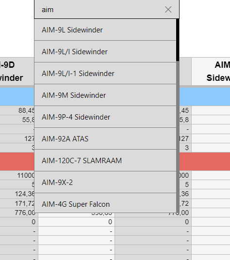
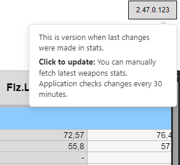

## War Thunder guided weapons

### About

Application provides guided weaponry data(in-game values). All data is collected from the [original](https://docs.google.com/spreadsheets/d/1SsOpw9LAKOs0V5FBnv1VqAlu3OssmX7DJaaVAUREw78/edit?gid=1624345539#gid=1624345539) google spreadsheets.

#### The data is organized in tables by weapons category



#### You can switch between tables by clicking on category in dropdown selector



#### Or you can manually search for weapon in a specific search field



#### Application checks for weapons data changes every 30 minute. But you can manually update it by clicking on button



### Run

```
docker-compose up
```

And go on

```
http://localhost:5173/
```

### Conclusion

You better to use [original](https://docs.google.com/spreadsheets/d/1SsOpw9LAKOs0V5FBnv1VqAlu3OssmX7DJaaVAUREw78/edit?gid=1624345539#gid=1624345539) google spreadsheets made by [Koppany99 aka JohnWick(9)](https://www.reddit.com/user/Koppany99/) and [gszabi99](https://github.com/gszabi99) because this application was written for practice purposes and it has many flaws and inconsistent data.
